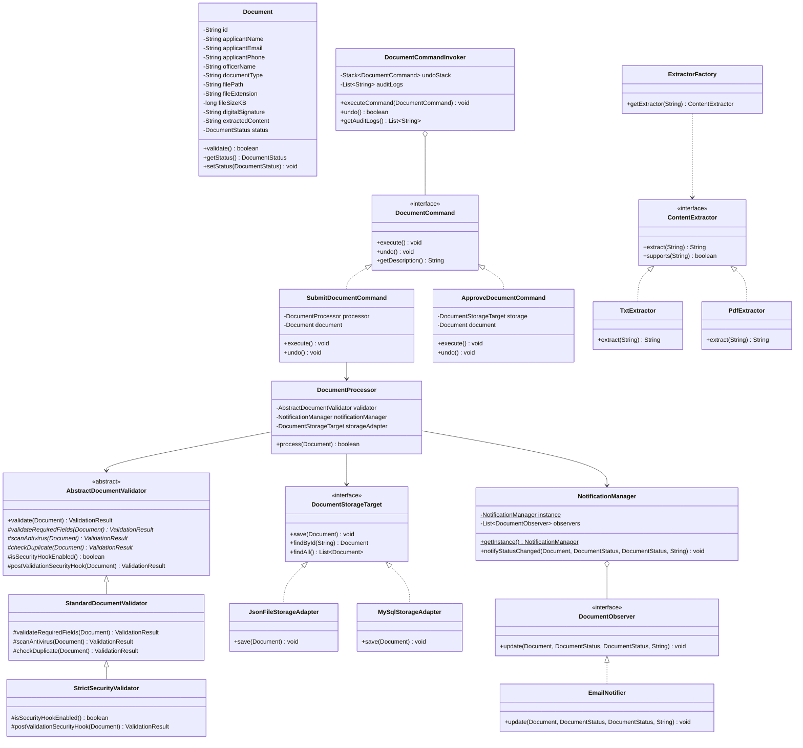
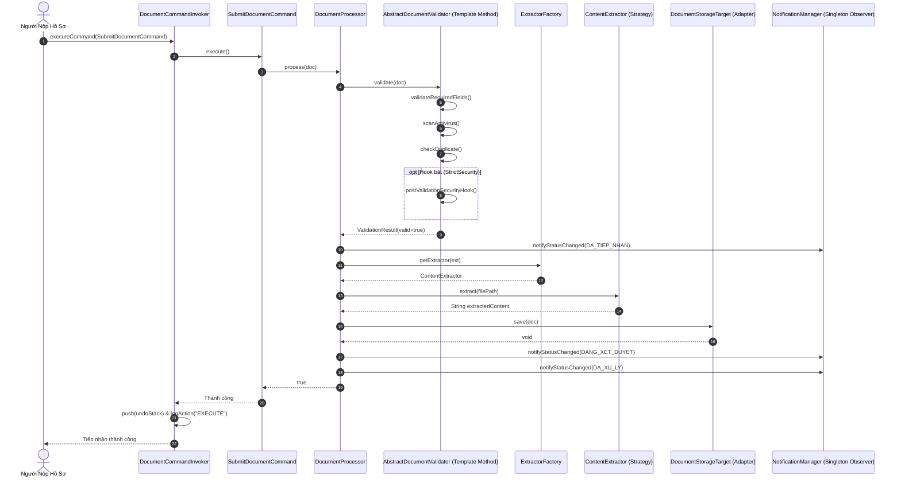

# TỔNG LIÊN ĐOÀN LAO ĐỘNG VIỆT NAM
# TRƯỜNG ĐẠI HỌC TÔN ĐỨC THẮNG
# KHOA CÔNG NGHỆ THÔNG TIN

---

# BÁO CÁO GIỮA KỲ
# MÔN HỌC: MẪU THIẾT KẾ (504077)

### ĐỀ TÀI: THIẾT KẾ VÀ NÂNG CẤP HỆ THỐNG TIẾP NHẬN VÀ XỬ LÝ HỒ SƠ ĐIỆN TỬ (eDOCUMENT v2.0)

**Mã nhóm:** `GKPT03`  
**Học kỳ / Năm học:** Học kỳ Giữa - Năm học 2026-2027  

**Danh sách sinh viên thực hiện:**
1. **Ngô Tấn Thành** - MSSV: `524H0031`
2. **Đỗ Quốc Trung** - MSSV: `524H0132`
3. **Nguyễn Quang Tựu** - MSSV: `524H0136`

**Người hướng dẫn:**  
ThS. Vũ Đình Hồng (Giảng viên bộ môn Công nghệ Phần mềm)

**Mã nguồn dự án:** [https://github.com/nguyenquangtuu/e-document.git](https://github.com/nguyenquangtuu/e-document.git)  

**THÀNH PHỐ HỒ CHÍ MINH, NĂM 2026**

---

# LỜI CẢM ƠN

Lời đầu tiên, nhóm sinh viên chúng em xin gửi lời tri ân sâu sắc đến Thầy ThS. Vũ Đình Hồng – giảng viên phụ trách bộ môn Mẫu Thiết Kế (Design Patterns). Thầy đã tận tình giảng dạy, truyền đạt những kiến thức quý báu và định hướng tư duy thiết kế phần mềm hướng đối tượng chuẩn mực. Chính những nền tảng lý thuyết vững chắc cùng sự hướng dẫn tận tâm của Thầy đã tạo tiền đề để nhóm chúng em có thể phân tích, đánh giá kiến trúc và hoàn thành bài báo cáo tiểu luận này.

Tiếp theo, chúng em xin chân thành cảm ơn Ban Lãnh đạo Khoa Công Nghệ Thông Tin – Trường Đại học Tôn Đức Thắng đã tạo điều kiện học tập thuận lợi, cung cấp môi trường nghiên cứu và thực hành bổ ích. Môn học đã mang lại cho chúng em cơ hội vận dụng lý thuyết vào thực tiễn, nâng cao kỹ năng tư duy trừu tượng, phân tích kiến trúc phần mềm và kỹ năng làm việc nhóm.

Cuối cùng, mặc dù đã dành nhiều nỗ lực để nghiên cứu tài liệu, rà soát mã nguồn và hiện thực hóa hệ thống, song do kiến thức và kinh nghiệm thực tế còn hạn chế, bài báo cáo khó tránh khỏi những thiếu sót nhất định. Nhóm chúng em rất mong nhận được những nhận xét, góp ý và chỉ dẫn quý báu từ quý Thầy Cô để sản phẩm được hoàn thiện hơn nữa trong tương lai.

Chúng em xin chân thành cảm ơn!

---

# ĐỒ ÁN ĐƯỢC HOÀN THÀNH TẠI TRƯỜNG ĐẠI HỌC TÔN ĐỨC THẮNG

Chúng tôi xin cam đoan đây là sản phẩm đồ án tiểu luận của riêng nhóm chúng tôi, được thực hiện dưới sự giảng dạy và hướng dẫn của Thầy ThS. Vũ Đình Hồng. Các kết quả phân tích, thiết kế kiến trúc và mã nguồn trình bày trong tài liệu này là trung thực, độc lập và chưa từng được công bố trong bất kỳ báo cáo khoa học nào trước đây.

Mọi nội dung tham khảo, trích dẫn từ các tài liệu học thuật, giáo trình chuẩn của Trường Đại học Tôn Đức Thắng và các tài liệu chuẩn GoF quốc tế đều được chú thích nguồn gốc rõ ràng ở phần Tài liệu tham khảo.

Nếu phát hiện có bất kỳ sự gian lận hoặc sao chép trái phép nào, chúng tôi xin hoàn toàn chịu trách nhiệm trước Hội đồng bộ môn và kỷ luật của Trường Đại học Tôn Đức Thắng.

*Thành phố Hồ Chí Minh, ngày 10 tháng 10 năm 2026*

**Tác giả đồ án:**  
*(Ký và ghi rõ họ tên)*

1. Ngô Tấn Thành (MSSV: 524H0031)  
2. Đỗ Quốc Trung (MSSV: 524H0132)  
3. Nguyễn Quang Tựu (MSSV: 524H0136)  

---

# PHẦN XÁC NHẬN VÀ ĐÁNH GIÁ CỦA GIẢNG VIÊN

### Phần xác nhận của Giảng viên hướng dẫn
................................................................................................................................................  
................................................................................................................................................  
................................................................................................................................................  
................................................................................................................................................  
................................................................................................................................................  

*Tp. Hồ Chí Minh, ngày ...... tháng ...... năm 2026*  
*(Ký và ghi rõ họ tên)*

---

### Phần đánh giá của Giảng viên chấm bài
................................................................................................................................................  
................................................................................................................................................  
................................................................................................................................................  
................................................................................................................................................  
................................................................................................................................................  

*Điểm số bằng số:* .................... *Điểm số bằng chữ:* ............................................................  
*Tp. Hồ Chí Minh, ngày ...... tháng ...... năm 2026*  
*(Ký và ghi rõ họ tên)*

---

# MỤC LỤC

* **LỜI CẢM ƠN**
* **ĐỒ ÁN ĐƯỢC HOÀN THÀNH TẠI TRƯỜNG ĐẠI HỌC TÔN ĐỨC THẮNG**
* **PHẦN XÁC NHẬN VÀ ĐÁNH GIÁ CỦA GIẢNG VIÊN**
* **CHƯƠNG 1 – PHÂN TÍCH HIỆN TRẠNG HỆ THỐNG V1.0**
  * 1.1. Phân tích hiện trạng hệ thống Phiên bản 1.0
  * 1.2. Xác định các hạn chế và thiết kế kém trong mã nguồn cũ
  * 1.3. Đánh giá tác động của kiến trúc cũ đối với khả năng mở rộng
* **CHƯƠNG 2 – PHÂN TÍCH VÀ ĐỀ XUẤT GIẢI PHÁP THIẾT KẾ CHO PHIÊN BẢN 2.0**
  * 2.1. Giải pháp cho Yêu cầu 1: Quản lý thao tác nộp, duyệt hồ sơ, hỗ trợ Hoàn tác (Undo/Redo) và Audit Logging $\rightarrow$ Command Pattern (Chương 7)
    * 2.1.1. Phân tích hiện trạng bài toán
    * 2.1.2. Đề xuất giải pháp
    * 2.1.3. Sơ đồ lớp
    * 2.1.4. Mã nguồn chi tiết
  * 2.2. Giải pháp cho Yêu cầu 2: Tích hợp khả năng đọc nhiều định dạng tài liệu $\rightarrow$ Strategy Pattern kết hợp Factory Method (Chương 3 & 5)
    * 2.2.1. Phân tích hiện trạng bài toán
    * 2.2.2. Đề xuất giải pháp
    * 2.2.3. Sơ đồ lớp
    * 2.2.4. Mã nguồn chi tiết
  * 2.3. Giải pháp cho Yêu cầu 3: Quy trình kiểm duyệt hồ sơ nhiều bước có Hook an ninh $\rightarrow$ Template Method Pattern (Chương 4)
    * 2.3.1. Phân tích hiện trạng bài toán
    * 2.3.2. Đề xuất giải pháp
    * 2.3.3. Sơ đồ lớp
    * 2.3.4. Mã nguồn chi tiết
  * 2.4. Giải pháp cho Yêu cầu 4: Đăng ký nhận thông báo theo nhu cầu qua trung tâm quản lý duy nhất $\rightarrow$ Observer Pattern & Singleton Pattern (Chương 9 & 2)
    * 2.4.1. Phân tích hiện trạng bài toán
    * 2.4.2. Đề xuất giải pháp
    * 2.4.3. Sơ đồ lớp
    * 2.4.4. Mã nguồn chi tiết
  * 2.5. Giải pháp cho Yêu cầu 5: Mở rộng khả năng lưu trữ dữ liệu đa nền tảng $\rightarrow$ Adapter Pattern (Chương 8)
    * 2.5.1. Phân tích hiện trạng bài toán
    * 2.5.2. Đề xuất giải pháp
    * 2.5.3. Sơ đồ lớp
    * 2.5.4. Mã nguồn chi tiết
* **CHƯƠNG 3 – SƠ ĐỒ LỚP TỔNG THỂ V2.0 VÀ SƠ ĐỒ TUẦN TỰ**
  * 3.1. Sơ đồ lớp tổng thể (Overall Class Diagram)
  * 3.2. Sơ đồ tuần tự xử lý hồ sơ (Sequence Diagram)
  * 3.3. Bảng đối chiếu đồng nhất giữa Sơ đồ và Mã nguồn
* **CHƯƠNG 4 – ĐÁNH GIÁ NGUYÊN TẮC THIẾT KẾ SOLID VÀ NGUYÊN LÝ GOF**
  * 4.1. Single Responsibility Principle (SRP)
  * 4.2. Open/Closed Principle (OCP)
  * 4.3. Liskov Substitution Principle (LSP)
  * 4.4. Interface Segregation Principle (ISP)
  * 4.5. Dependency Inversion Principle (DIP)
  * 4.6. Hollywood Principle ("Don't call us, we'll call you")
* **CHƯƠNG 5 – KỊCH BẢN THỰC NGHIỆM VÀ ĐÁNH GIÁ KẾT QUẢ**
  * 5.1. Thiết kế 5 kịch bản kiểm thử thực nghiệm
  * 5.2. Kết quả chạy thực tế trên Console
  * 5.3. Trực quan hóa trên Giao diện đồ họa Swing UI
* **TÀI LIỆU THAM KHẢO**

---

# CHƯƠNG 1 – PHÂN TÍCH HIỆN TRẠNG HỆ THỐNG V1.0

### 1.1. Phân tích hiện trạng hệ thống Phiên bản 1.0
Hệ thống xử lý hồ sơ điện tử Phiên bản 1.0 được xây dựng dựa trên kiến trúc nguyên khối (Monolithic Architecture). Toàn bộ logic nghiệp vụ từ tiếp nhận hồ sơ, kiểm duyệt tính hợp lệ, trích xuất dữ liệu, lưu trữ cho đến gửi thông báo đều được tích hợp chặt chẽ trong một khối mã nguồn duy nhất. Điều này dẫn đến một hệ thống có tính kết dính lỏng lẻo và tính gắn kết quá cao (Tight Coupling), gây khó khăn nghiêm trọng trong việc phát triển, bảo trì và mở rộng.

Các nghiệp vụ chính của hệ thống V1.0 bao gồm:
* **Nghiệp vụ Tiếp nhận và Thao tác hồ sơ:** Người dùng và cán bộ thực hiện thao tác thông qua việc gọi trực tiếp các phương thức xử lý. Các hành động thay đổi trạng thái hồ sơ (như nộp hồ sơ, duyệt, từ chối) diễn ra tức thời mà không có bất kỳ cơ chế lưu vết lịch sử giao dịch hay hỗ trợ hoàn tác (Undo) nào. Khi cán bộ thao tác nhầm lẫn, hệ thống hoàn toàn bất lực trong việc khôi phục trạng thái ban đầu.
* **Nghiệp vụ Kiểm duyệt:** Hồ sơ được kiểm tra tính hợp lệ theo một chuỗi kiểm tra cố định (Kiểm tra Email $\rightarrow$ Tồn tại tệp $\rightarrow$ Dung lượng $\le$ 5MB $\rightarrow$ Đuôi tệp là .TXT). Chuỗi này được viết cứng (hardcoded) bằng các khối lệnh `if-else` lồng nhau. Nếu một điều kiện không thỏa mãn, hồ sơ lập tức bị đánh dấu từ chối mà không có cơ chế tùy biến hoặc ngắt luồng linh hoạt theo từng tiêu chuẩn an ninh riêng biệt.
* **Nghiệp vụ Trích xuất nội dung:** Hệ thống chỉ hỗ trợ đọc nội dung tệp văn bản thô `.TXT`. Các định dạng phổ biến trong hành chính điện tử như tài liệu `.PDF` hay hình ảnh `.JPG`, `.PNG` (cần qua xử lý OCR) hoàn toàn bị bỏ qua hoặc để trống.
* **Nghiệp vụ Lưu trữ dữ liệu:** Toàn bộ thông tin hồ sơ được gom thành một cấu trúc và ghi trực tiếp thành các file `.json` phân tán trên ổ cứng cục bộ của máy chủ. Mã nguồn I/O ghi tệp nằm trực tiếp bên trong lớp xử lý nghiệp vụ chính, hoàn toàn không có khả năng kết nối tới các hệ quản trị cơ sở dữ liệu (MySQL) hay dịch vụ lưu trữ đám mây (Cloud S3).
* **Nghiệp vụ Gửi thông báo:** Hệ thống tự động gửi đồng thời cả Email và SMS cho người nộp bất kể nhu cầu của họ. Các lớp dịch vụ gửi tin được khởi tạo tùy tiện khắp nơi trong hệ thống, gây lãng phí tài nguyên và vi phạm việc quản lý tập trung.

#### Bảng 1.1: So sánh các nghiệp vụ chính của hệ thống V1.0
| Nghiệp vụ | Đặc điểm hiện tại (V1.0) | Hạn chế xác định |
| :--- | :--- | :--- |
| **Tiếp nhận & Thao tác** | Thao tác thay đổi trạng thái gọi trực tiếp, không có lịch sử lệnh. | Thiếu linh hoạt, không có khả năng hoàn tác (Undo), không có nhật ký Audit Log. |
| **Kiểm duyệt** | Chuỗi kiểm tra cố định bằng `if-else`, cứng nhắc, không thay đổi được thứ tự. | Khó mở rộng trạm mới, vi phạm OCP, logic phức tạp và thiếu khả năng tùy biến an ninh cao. |
| **Trích xuất** | Chỉ hỗ trợ đọc tệp `.TXT`, không xử lý được `.PDF`, `.JPG`. | Không đáp ứng nhu cầu hồ sơ điện tử đa dạng, thiếu khả năng mở rộng thuật toán đọc. |
| **Lưu trữ** | Ghi trực tiếp tệp `.json` cục bộ, mã nguồn dính chặt vào I/O. | Rủi ro mất mát dữ liệu, khó quản lý tìm kiếm, vi phạm nguyên tắc DIP. |
| **Thông báo** | Gửi đồng thời cả Email và SMS mặc định, khởi tạo đối tượng tùy tiện. | Gây phiền hà cho người dùng, lãng phí tài nguyên, thiếu quản lý trung tâm (Singleton). |

---

### 1.2. Xác định các hạn chế và thiết kế kém trong mã nguồn cũ
Qua phân tích mã nguồn phiên bản V1.0, nhóm xác định được các vấn đề nghiêm trọng gây ảnh hưởng tiêu cực đến chất lượng và khả năng bảo trì của hệ thống. Dựa trên lý thuyết của Robert C. Martin, kiến trúc cũ biểu hiện rõ 3 triệu chứng mục rữa (Design Smells):

1. **Rigidity (Tính cứng nhắc):** Hệ thống cực kỳ khó thay đổi. Việc bổ sung một tính năng kiểm tra mã độc hoặc đổi nơi lưu trữ sang Database đòi hỏi phải can thiệp trực tiếp vào mã nguồn cốt lõi trong `DocumentProcessor.java`.
2. **Fragility (Tính dễ vỡ):** Do các thành phần phụ thuộc chặt chẽ vào nhau, việc sửa đổi logic lưu trữ tệp có thể vô tình làm hỏng luồng gửi thông báo hoặc luồng trích xuất dữ liệu.
3. **Immobility (Tính bất động):** Các đoạn mã như đọc file `.txt` hay gửi tin nhắn SMS được viết lồng ghép sâu bên trong nghiệp vụ chính, khiến chúng không thể tái sử dụng ở các module khác mà buộc phải sao chép mã (copy-paste).

Các khiếm khuyết thiết kế (Code Smells) cụ thể:
* **Non-reversible Actions (Thiếu Command Pattern):** Các hành động cập nhật trạng thái hồ sơ bị phân tán, không được đóng gói thành các đối tượng hành vi độc lập, dẫn đến không thể hỗ trợ cơ chế Undo/Redo.
* **Switch Statements / If-Else Chains (Vi phạm OCP):** Xuất hiện dày đặc các cấu trúc điều kiện để phân loại đuôi file và kiểm duyệt dữ liệu. Mỗi khi thêm định dạng mới, lập trình viên buộc phải sửa đổi trực tiếp vào khối lệnh điều kiện này.
* **Rigid Monolithic Flow (Thiếu Template Method):** Quy trình xử lý không có khung xương (Skeleton) thuật toán chuẩn hóa, không có các Hook Method để các lớp con can thiệp vào các bước kiểm tra chuyên biệt.
* **Hardcoded Dependencies (Vi phạm DIP & Singleton):** Lớp nghiệp vụ phụ thuộc trực tiếp vào các lớp cụ thể của bên thứ ba, đồng thời thiếu cơ chế quản lý vòng đời duy nhất cho các thành phần điều phối thông báo.

---

### 1.3. Đánh giá tác động của kiến trúc cũ đối với khả năng mở rộng
Kiến trúc V1.0 đã bộc lộ những hạn chế chí mạng khi hệ thống cần mở rộng quy mô:
* **Khó khăn trong việc mở rộng tính năng mới:** Đội ngũ phát triển mất rất nhiều thời gian để "mổ xẻ" và sửa đổi mã nguồn cũ. Thời gian triển khai kéo dài do rủi ro phát sinh lỗi hồi quy (regression bugs) rất cao.
* **Hạn chế về hiệu năng và kiểm thử tự động:** Vì luồng xử lý bị gắn cứng tuần tự, hệ thống không thể tách rời các tác vụ nặng (như OCR hình ảnh hay quét virus) ra để xử lý song song hoặc viết các bài Unit Test độc lập.
* **Rủi ro triển khai cao:** Một lỗi nhỏ xảy ra trong logic lưu trữ tệp cục bộ có thể làm tê liệt toàn bộ quy trình nộp hồ sơ, ảnh hưởng nghiêm trọng đến tính sẵn sàng của dịch vụ công.

---

# CHƯƠNG 2 – PHÂN TÍCH VÀ ĐỀ XUẤT GIẢI PHÁP THIẾT KẾ CHO PHIÊN BẢN 2.0

Nhằm khắc phục triệt để các nhược điểm trên, hệ thống phiên bản 2.0 được tái cấu trúc bằng việc áp dụng **100% các Mẫu Thiết Kế GoF nằm trong Đề Cương Môn Học (Course Syllabus 504077)** của Trường Đại học Tôn Đức Thắng.

---

### 2.1. Giải pháp cho Yêu cầu 1: Quản lý thao tác nộp, duyệt hồ sơ, hỗ trợ Hoàn tác (Undo/Redo) và Audit Logging $\rightarrow$ Command Pattern (Chương 7)

#### 2.1.1. Phân tích hiện trạng bài toán
* **Vấn đề:** Trong phiên bản cũ, các hành vi tiếp nhận hồ sơ, cán bộ phê duyệt hoặc từ chối hồ sơ được gọi trực tiếp thông qua các lời gọi hàm phân tán.
* **Hạn chế:**
  * **Thiếu khả năng đảo ngược:** Khi cán bộ thao tác nhầm lẫn (ví dụ phê duyệt nhầm một hồ sơ chưa đủ điều kiện), hệ thống không có cách nào khôi phục lại trạng thái trước đó một cách tự động.
  * **Thiếu nhật ký giao dịch (Audit Log):** Không ghi nhận được lịch sử ai đã làm gì, vào thời điểm nào, vi phạm nghiêm trọng tiêu chuẩn an toàn trong quản lý hồ sơ điện tử.

#### 2.1.2. Đề xuất giải pháp
* **Pattern lựa chọn:** **Command Pattern** (Chương 7 - Syllabus).
* **Lý do lựa chọn:**
  * Giải quyết hoàn hảo **Case study 2 (Undo / Redo)** và **Case study 3 (Logging)** theo đúng mục 7.5 và 7.6 trong đề cương môn học.
  * Đóng gói mỗi yêu cầu xử lý hồ sơ thành một đối tượng độc lập (`SubmitDocumentCommand`, `ApproveDocumentCommand`, `RejectDocumentCommand`).
  * Tách biệt đối tượng đưa ra yêu cầu (Invoker) khỏi đối tượng trực tiếp thực thi nghiệp vụ (Receiver).

#### 2.1.3. Sơ đồ lớp
```
+-----------------------------------+
|      <<interface>>                |
|      DocumentCommand              |
+-----------------------------------+
| + execute(): void                 |
| + undo(): void                    |
| + getDescription(): String        |
+-----------------------------------+
          ^             ^
          |             |
+-------------------+ +---------------------+
|SubmitDocumentCmd  | |ApproveDocumentCmd   |
+-------------------+ +---------------------+
| - processor       | | - storage           |
| - document        | | - document          |
| - previousStatus  | | - previousStatus    |
+-------------------+ +---------------------+

+-----------------------------------+
|      DocumentCommandInvoker       |
+-----------------------------------+
| - undoStack: Stack<DocumentCommand>
| - redoStack: Stack<DocumentCommand>
| - auditLogs: List<String>         |
+-----------------------------------+
| + executeCommand(cmd): void       |
| + undo(): boolean                 |
| + redo(): boolean                 |
| + getAuditLogs(): List<String>    |
+-----------------------------------+
```

#### 2.1.4. Mã nguồn chi tiết
```java
// command/DocumentCommand.java
package command;
import model.Document;

public interface DocumentCommand {
    void execute() throws Exception;
    void undo() throws Exception;
    String getDescription();
    Document getDocument();
}
```

```java
// command/ApproveDocumentCommand.java
package command;
import model.Document;
import model.DocumentStatus;
import notification.NotificationManager;
import storage.DocumentStorageTarget;

public class ApproveDocumentCommand implements DocumentCommand {
    private final DocumentStorageTarget storage;
    private final Document document;
    private final String officerNote;
    private DocumentStatus previousStatus;

    public ApproveDocumentCommand(DocumentStorageTarget storage, Document document, String officerNote) {
        this.storage = storage;
        this.document = document;
        this.officerNote = officerNote;
        this.previousStatus = (document != null) ? document.getStatus() : null;
    }

    @Override
    public void execute() throws Exception {
        if (document == null) return;
        this.previousStatus = document.getStatus();
        document.setStatus(DocumentStatus.DA_XU_LY);
        if (storage != null) storage.save(document);
        NotificationManager.getInstance().notifyStatusChanged(
            document, previousStatus, DocumentStatus.DA_XU_LY, 
            "Can bo da phe duyet: " + officerNote
        );
    }

    @Override
    public void undo() throws Exception {
        if (document == null) return;
        DocumentStatus current = document.getStatus();
        document.setStatus(previousStatus);
        if (storage != null) storage.save(document);
        NotificationManager.getInstance().notifyStatusChanged(
            document, current, previousStatus, 
            "Hoan tac (Undo) phe duyet ve trang thai: " + previousStatus.getDisplayName()
        );
    }

    @Override
    public String getDescription() { return "Phe duyet ho so: " + document.getId(); }
    @Override
    public Document getDocument() { return document; }
}
```

---

### 2.2. Giải pháp cho Yêu cầu 2: Tích hợp khả năng đọc nhiều định dạng tài liệu $\rightarrow$ Strategy Pattern kết hợp Factory Method (Chương 3 & 5)

#### 2.2.1. Phân tích hiện trạng bài toán
* **Vấn đề:** Logic đọc tệp tin được viết trực tiếp bên trong `DocumentProcessor.java` và chỉ hỗ trợ định dạng `.txt`.
* **Hạn chế:**
  * **Vi phạm Open/Closed Principle (OCP):** Khi cần đọc thêm file `.pdf` hay OCR hình ảnh `.jpg`, lập trình viên buộc phải can thiệp sửa đổi luồng xử lý chính.
  * **Vi phạm Single Responsibility Principle (SRP):** Lớp xử lý nghiệp vụ hồ sơ không nên chứa chi tiết thuật toán đọc tệp hay gọi dịch vụ OCR.

#### 2.2.2. Đề xuất giải pháp
* **Pattern lựa chọn:** **Strategy Pattern** (Chương 3) kết hợp **Factory Method Pattern** (Chương 5).
* **Lý do lựa chọn:**
  * **Strategy Pattern:** Đóng gói từng thuật toán trích xuất thành các lớp riêng biệt (`TxtExtractor`, `PdfExtractor`, `ImageOcrExtractor`), giúp chúng có thể hoán đổi linh hoạt lúc runtime.
  * **Factory Method:** Gỡ bỏ hoàn toàn `if-else` trong luồng chính, ủy quyền việc khởi tạo Strategy cho `ExtractorFactory`.

#### 2.2.3. Sơ đồ lớp
```
          +-----------------------+
          |     <<interface>>     |
          |    ContentExtractor   |
          +-----------------------+
          | + extract(path): String
          | + supports(ext): bool |
          +-----------------------+
             ^         ^         ^
             |         |         |
+----------------+ +----------------+ +--------------------+
|  TxtExtractor  | |  PdfExtractor  | | ImageOcrExtractor  |
+----------------+ +----------------+ +--------------------+

+-----------------------------------------+
|            ExtractorFactory             |
+-----------------------------------------+
| + getExtractor(ext): ContentExtractor   |
+-----------------------------------------+
```

#### 2.2.4. Mã nguồn chi tiết
```java
// extractor/ContentExtractor.java
package extractor;
import java.io.IOException;

public interface ContentExtractor {
    String extract(String filePath) throws IOException;
    boolean supports(String fileExtension);
}
```

```java
// extractor/ExtractorFactory.java
package extractor;

public class ExtractorFactory {
    public static ContentExtractor getExtractor(String extension) {
        if (extension == null) return new TxtExtractor();
        switch (extension.toLowerCase().trim()) {
            case "pdf": return new PdfExtractor();
            case "jpg":
            case "jpeg":
            case "png": return new ImageOcrExtractor();
            case "txt":
            default: return new TxtExtractor();
        }
    }
}
```

---

### 2.3. Giải pháp cho Yêu cầu 3: Quy trình kiểm duyệt hồ sơ nhiều bước có Hook an ninh $\rightarrow$ Template Method Pattern (Chương 4)

#### 2.3.1. Phân tích hiện trạng bài toán
* **Vấn đề:** Các bước kiểm duyệt thông tin, dung lượng tệp và kiểm tra định dạng bị dồn cục trong một hàm duy nhất.
* **Hạn chế:**
  * Không thể tái sử dụng khung thuật toán kiểm duyệt.
  * Không hỗ trợ phân nhánh các chính sách kiểm duyệt khác nhau (ví dụ: hồ sơ thông thường chỉ kiểm duyệt cơ bản, trong khi hồ sơ bảo mật cao bắt buộc phải có chữ ký số RSA và Whitelist định dạng).

#### 2.3.2. Đề xuất giải pháp
* **Pattern lựa chọn:** **Template Method Pattern** (Chương 4 - Syllabus).
* **Lý do lựa chọn:**
  * **Cố định khung thuật toán:** Lớp trừu tượng `AbstractDocumentValidator` định nghĩa template method `final validate(Document doc)`, đảm bảo không lớp con nào có thể thay đổi thứ tự các bước cốt lõi.
  * **Tuân thủ Hollywood Principle:** *"Don't call us, we'll call you"* – lớp cha kiểm soát tiến trình và gọi các phương thức nguyên thủy của lớp con.
  * **Tận dụng Hook Method:** Cung cấp phương thức Hook `isSecurityHookEnabled()` và `postValidationSecurityHook()` cho phép `StrictSecurityValidator` kích hoạt kiểm tra chữ ký số RSA mà không phá vỡ cấu trúc chung.

#### 2.3.3. Sơ đồ lớp
```
+-----------------------------------------------------+
|             AbstractDocumentValidator               |
+-----------------------------------------------------+
| + validate(doc): ValidationResult (final)           |
| # validateRequiredFields(doc)*: ValidationResult    |
| # scanAntivirus(doc)*: ValidationResult             |
| # checkDuplicate(doc)*: ValidationResult            |
| # isSecurityHookEnabled(): boolean (Hook)           |
| # postValidationSecurityHook(doc): ValidationResult |
+-----------------------------------------------------+
                          ^
                          |
+-----------------------------------+
|     StandardDocumentValidator     |
+-----------------------------------+
| # validateRequiredFields(...)     |
| # scanAntivirus(...)              |
| # checkDuplicate(...)             |
+-----------------------------------+
                  ^
                  |
+-----------------------------------+
|      StrictSecurityValidator      |
+-----------------------------------+
| # isSecurityHookEnabled(): true   |
| # postValidationSecurityHook(...) |
+-----------------------------------+
```

#### 2.3.4. Mã nguồn chi tiết
```java
// validation/AbstractDocumentValidator.java
package validation;
import model.Document;

public abstract class AbstractDocumentValidator {
    // TEMPLATE METHOD: Co dinh khung quy trinh kiem duyet
    public final ValidationResult validate(Document doc) {
        if (doc == null) return ValidationResult.failure("InputCheck", "Ho so null");

        ValidationResult r1 = validateRequiredFields(doc);
        if (!r1.isValid()) return r1;

        ValidationResult r2 = scanAntivirus(doc);
        if (!r2.isValid()) return r2;

        ValidationResult r3 = checkDuplicate(doc);
        if (!r3.isValid()) return r3;

        // HOOK METHOD (Hollywood Principle)
        if (isSecurityHookEnabled()) {
            ValidationResult rHook = postValidationSecurityHook(doc);
            if (!rHook.isValid()) return rHook;
        }

        return ValidationResult.success();
    }

    protected abstract ValidationResult validateRequiredFields(Document doc);
    protected abstract ValidationResult scanAntivirus(Document doc);
    protected abstract ValidationResult checkDuplicate(Document doc);

    protected boolean isSecurityHookEnabled() { return false; }
    protected ValidationResult postValidationSecurityHook(Document doc) { return ValidationResult.success(); }
}
```

```java
// validation/StrictSecurityValidator.java
package validation;
import model.Document;

public class StrictSecurityValidator extends StandardDocumentValidator {
    @Override
    protected boolean isSecurityHookEnabled() {
        return true; // Kich hoat Hook an ninh
    }

    @Override
    protected ValidationResult postValidationSecurityHook(Document doc) {
        String sig = doc.getDigitalSignature();
        if (sig == null || !sig.startsWith("RSA")) {
            return ValidationResult.failure("StrictSecurityHook", "Chung thu chu ky so RSA khong hop le.");
        }
        return ValidationResult.success();
    }
}
```

---

### 2.4. Giải pháp cho Yêu cầu 4: Đăng ký nhận thông báo theo nhu cầu qua trung tâm quản lý duy nhất $\rightarrow$ Observer Pattern & Singleton Pattern (Chương 9 & 2)

#### 2.4.1. Phân tích hiện trạng bài toán
* **Vấn đề:** Logic gửi thông báo qua Email và SMS được "gắn cứng" trong hàm xử lý chính. Các đối tượng quản lý thông báo được khởi tạo rải rác.
* **Hạn chế:**
  * Không cho phép người dùng tùy chọn kênh nhận tin (chỉ thích Email hoặc chỉ thích App Push).
  * Vi phạm nguyên tắc quản lý tài nguyên: khởi tạo nhiều thực thể phân phối thông báo gây xung đột cấu hình.

#### 2.4.2. Đề xuất giải pháp
* **Pattern lựa chọn:** **Observer Pattern** (Chương 9) kết hợp **Singleton Pattern** (Chương 2).
* **Lý do lựa chọn:**
  * **Singleton Pattern:** Đảm bảo toàn bộ hệ thống chỉ tồn tại duy nhất một thực thể `NotificationManager` thông qua cơ chế *Lazy Instantiation* và *Double-Checked Locking*.
  * **Observer Pattern:** Khử liên kết dính chặt giữa `DocumentProcessor` và các kênh gửi tin. Lớp xử lý chỉ cần phát tín hiệu trạng thái thay đổi, `NotificationManager` sẽ tự động chuyển phát đến các Observer đã đăng ký (`EmailNotifier`, `SmsNotifier`, `AppPushNotifier`).

#### 2.4.3. Sơ đồ lớp
```
+-------------------------------------------------+
|               NotificationManager               |
+-------------------------------------------------+
| - instance: NotificationManager (static volatile|
| - observers: List<DocumentObserver>             |
| - userPreferences: Map<String, Set<String>>     |
+-------------------------------------------------+
| - NotificationManager()                         |
| + getInstance(): NotificationManager (static)   |
| + attach(observer): void                        |
| + detach(observer): void                        |
| + notifyStatusChanged(doc, old, new, msg): void |
+-------------------------------------------------+
                        |
                        o (1..*)
+-------------------------------------------------+
|            <<interface>> DocumentObserver       |
+-------------------------------------------------+
| + update(doc, oldStatus, newStatus, msg): void  |
| + getChannelName(): String                      |
+-------------------------------------------------+
           ^                ^                ^
           |                |                |
+------------------+ +-------------+ +------------------+
|  EmailNotifier   | | SmsNotifier | | AppPushNotifier  |
+------------------+ +-------------+ +------------------+
```

#### 2.4.4. Mã nguồn chi tiết
```java
// notification/NotificationManager.java
package notification;
import model.Document;
import model.DocumentStatus;
import java.util.*;

public class NotificationManager {
    private static volatile NotificationManager instance;
    private final List<DocumentObserver> observers = new ArrayList<>();
    private final Map<String, Set<String>> userPreferences = new HashMap<>();

    private NotificationManager() {
        attach(new EmailNotifier());
        attach(new SmsNotifier());
        attach(new AppPushNotifier());
    }

    public static NotificationManager getInstance() {
        if (instance == null) {
            synchronized (NotificationManager.class) {
                if (instance == null) {
                    instance = new NotificationManager();
                }
            }
        }
        return instance;
    }

    public void attach(DocumentObserver observer) {
        if (observer != null && !observers.contains(observer)) observers.add(observer);
    }

    public void notifyStatusChanged(Document doc, DocumentStatus oldStatus, DocumentStatus newStatus, String message) {
        if (doc == null) return;
        String email = doc.getApplicantEmail();
        Set<String> pref = (email != null) ? userPreferences.get(email) : null;
        for (DocumentObserver o : observers) {
            if (pref == null || pref.contains(o.getChannelName().toUpperCase())) {
                o.update(doc, oldStatus, newStatus, message);
            }
        }
    }
}
```

---

### 2.5. Giải pháp cho Yêu cầu 5: Mở rộng khả năng lưu trữ dữ liệu đa nền tảng $\rightarrow$ Adapter Pattern (Chương 8)

#### 2.5.1. Phân tích hiện trạng bài toán
* **Vấn đề:** Lớp nghiệp vụ chứa trực tiếp mã nguồn mở tệp, ghi chuỗi JSON xuống ổ cứng máy chủ.
* **Hạn chế:**
  * **Vi phạm Dependency Inversion Principle (DIP):** Module cấp cao dính chặt vào I/O cấp thấp.
  * Không thể chuyển đổi hoặc mở rộng sang lưu trữ Cơ sở dữ liệu (MySQL) hay Cloud (AWS S3) mà không phải sửa đổi lại toàn bộ logic xử lý hồ sơ.

#### 2.5.2. Đề xuất giải pháp
* **Pattern lựa chọn:** **Adapter Pattern** (Chương 8 - Syllabus).
* **Lý do lựa chọn:**
  * Giải quyết bài toán kinh điển **Case study: Adapter in software** (Mục 8.4 trong đề cương môn học).
  * Xây dựng Target Interface `DocumentStorageTarget` chuẩn hóa các thao tác `save`, `findById`, `findAll`, `delete`.
  * Các lớp Adapter (`JsonFileStorageAdapter`, `MySqlStorageAdapter`, `AwsS3StorageAdapter`) đóng vai trò cầu nối thích ứng giữa giao tiếp chuẩn của hệ thống với các hệ quản trị lưu trữ khác nhau.

#### 2.5.3. Sơ đồ lớp
```
+-------------------------------------------------+
|            <<interface>> Target                 |
|            DocumentStorageTarget                |
+-------------------------------------------------+
| + save(doc): void                               |
| + findById(id): Document                        |
| + findAll(): List<Document>                     |
| + delete(id): void                              |
| + getStorageName(): String                      |
+-------------------------------------------------+
         ^                  ^                  ^
         |                  |                  |
+------------------+ +-----------------+ +--------------------+
|JsonFileStorage   | |MySqlStorage     | |AwsS3Storage        |
|Adapter           | |Adapter          | |Adapter             |
+------------------+ +-----------------+ +--------------------+
| - storageDirPath | | - simulatedDb   | | - bucketName       |
+------------------+ +-----------------+ +--------------------+
```

#### 2.5.4. Mã nguồn chi tiết
```java
// storage/DocumentStorageTarget.java
package storage;
import model.Document;
import java.util.List;

public interface DocumentStorageTarget {
    void save(Document doc) throws Exception;
    Document findById(String id) throws Exception;
    List<Document> findAll() throws Exception;
    void delete(String id) throws Exception;
    String getStorageName();
}
```

```java
// storage/MySqlStorageAdapter.java
package storage;
import model.Document;
import java.util.*;

public class MySqlStorageAdapter implements DocumentStorageTarget {
    private final Map<String, Document> simulatedDbTable = Collections.synchronizedMap(new LinkedHashMap<>());

    @Override
    public String getStorageName() { return "MySQL Database Storage"; }

    @Override
    public void save(Document doc) throws Exception {
        if (doc == null || doc.getId() == null) return;
        simulatedDbTable.put(doc.getId(), new Document(doc));
        System.out.println("[MySqlStorageAdapter] SQL: INSERT INTO documents VALUES ('" + doc.getId() + "') -> SUCCESS.");
    }

    @Override
    public Document findById(String id) throws Exception {
        Document d = simulatedDbTable.get(id);
        return (d != null) ? new Document(d) : null;
    }

    @Override
    public List<Document> findAll() throws Exception {
        List<Document> list = new ArrayList<>();
        for (Document d : simulatedDbTable.values()) list.add(new Document(d));
        return list;
    }

    @Override
    public void delete(String id) throws Exception { simulatedDbTable.remove(id); }
}
```

---

# CHƯƠNG 3 – SƠ ĐỒ LỚP TỔNG THỂ V2.0 VÀ SƠ ĐỒ TUẦN TỰ

### 3.1. Sơ đồ lớp tổng thể (Overall Class Diagram)



---

### 3.2. Sơ đồ tuần tự xử lý hồ sơ (Sequence Diagram)



---

### 3.3. Bảng đối chiếu đồng nhất giữa Sơ đồ và Mã nguồn

| Thành phần trên Sơ đồ UML | Tên file mã nguồn | Mẫu Thiết Kế Tương Ứng (Syllabus) |
| :--- | :--- | :--- |
| `DocumentCommand` | `command/DocumentCommand.java` | **Command Pattern** (Chương 7) |
| `SubmitDocumentCommand` | `command/SubmitDocumentCommand.java` | **Command Pattern** (Chương 7) |
| `ApproveDocumentCommand` | `command/ApproveDocumentCommand.java` | **Command Pattern** (Chương 7) |
| `DocumentCommandInvoker` | `command/DocumentCommandInvoker.java` | **Command Pattern** (Chương 7) |
| `AbstractDocumentValidator` | `validation/AbstractDocumentValidator.java` | **Template Method Pattern** (Chương 4) |
| `StandardDocumentValidator` | `validation/StandardDocumentValidator.java` | **Template Method Pattern** (Chương 4) |
| `StrictSecurityValidator` | `validation/StrictSecurityValidator.java` | **Template Method Pattern** (Chương 4) |
| `ContentExtractor` | `extractor/ContentExtractor.java` | **Strategy Pattern** (Chương 3) |
| `ExtractorFactory` | `extractor/ExtractorFactory.java` | **Factory Method Pattern** (Chương 5) |
| `DocumentStorageTarget` | `storage/DocumentStorageTarget.java` | **Adapter Pattern** (Chương 8) |
| `JsonFileStorageAdapter` | `storage/JsonFileStorageAdapter.java` | **Adapter Pattern** (Chương 8) |
| `MySqlStorageAdapter` | `storage/MySqlStorageAdapter.java` | **Adapter Pattern** (Chương 8) |
| `AwsS3StorageAdapter` | `storage/AwsS3StorageAdapter.java` | **Adapter Pattern** (Chương 8) |
| `NotificationManager` | `notification/NotificationManager.java` | **Singleton & Observer** (Chương 2 & 9) |
| `DocumentObserver` | `notification/DocumentObserver.java` | **Observer Pattern** (Chương 9) |

---

# CHƯƠNG 4 – ĐÁNH GIÁ NGUYÊN TẮC THIẾT KẾ SOLID VÀ NGUYÊN LÝ GOF

### 4.1. Single Responsibility Principle (SRP)
* Mỗi lớp chỉ có một lý do duy nhất để thay đổi:
  * `TxtExtractor` chỉ chịu trách nhiệm đọc nội dung văn bản thuần.
  * `NotificationManager` chỉ quản lý danh sách đăng ký và chuyển tiếp sự kiện thông báo.
  * `JsonFileStorageAdapter` chỉ đảm nhiệm việc đọc ghi và ánh xạ đối tượng JSON ra tệp vật lý.
  * `DocumentCommandInvoker` chỉ quản lý ngăn xếp Undo/Redo và lưu trữ nhật ký Audit Log.

### 4.2. Open/Closed Principle (OCP)
* Hệ thống mở rộng linh hoạt mà không cần sửa đổi mã nguồn sẵn có:
  * Thêm định dạng tệp `.docx`: Chỉ cần tạo `DocxExtractor implements ContentExtractor` và đăng ký trong `ExtractorFactory`.
  * Thêm hệ quản trị CSDL PostgreSQL: Chỉ cần tạo `PostgreSqlStorageAdapter implements DocumentStorageTarget`.
  * Thêm chính sách kiểm duyệt Hải quan: Chỉ cần tạo `CustomsValidator extends AbstractDocumentValidator`.
  * Lớp xử lý trung tâm `DocumentProcessor` hoàn toàn đóng đối với sự thay đổi.

### 4.3. Liskov Substitution Principle (LSP)
* Các lớp con (`StandardDocumentValidator`, `StrictSecurityValidator`) có thể thay thế hoàn toàn cho lớp cha `AbstractDocumentValidator` mà không làm phá vỡ tính đúng đắn của chương trình.
* Mọi Storage Adapter đều có thể thay thế cho `DocumentStorageTarget` mà không làm thay đổi hợp đồng lưu trữ.

### 4.4. Interface Segregation Principle (ISP)
* Các giao diện được thiết kế độc lập, tập trung và tinh gọn:
  * `DocumentCommand` chỉ chứa các phương thức phục vụ thực thi lệnh và hoàn tác.
  * `DocumentObserver` chỉ chứa phương thức nhận cập nhật trạng thái.
  * `DocumentStorageTarget` chỉ tập trung vào các thao tác CRUD dữ liệu.

### 4.5. Dependency Inversion Principle (DIP)
* Module cấp cao `DocumentProcessor` không hề phụ thuộc trực tiếp vào bất kỳ module cấp thấp cụ thể nào (`JsonFileStorageAdapter`, `EmailNotifier`, `TxtExtractor`). Thay vào đó, toàn bộ mối quan hệ phụ thuộc đều thông qua các Abstraction (`DocumentStorageTarget`, `AbstractDocumentValidator`, `ContentExtractor`).

### 4.6. Hollywood Principle ("Don't call us, we'll call you")
* Được minh chứng rõ nét trong **Template Method Pattern**: Lớp cha `AbstractDocumentValidator` giữ quyền điều phối tối cao, chủ động gọi các bước nguyên thủy và Hook Method của lớp con khi đến lượt. Lớp con tuyệt đối không gọi ngược lên để can thiệp luồng của lớp cha.

---

# CHƯƠNG 5 – KỊCH BẢN THỰC NGHIỆM VÀ ĐÁNH GIÁ KẾT QUẢ

### 5.1. Thiết kế 5 kịch bản kiểm thử thực nghiệm
1. **Kịch bản 1:** Kiểm chứng Template Method và Singleton Notification với hồ sơ hợp lệ.
2. **Kịch bản 2:** Kiểm chứng Hook Method của Template Method chặn đứng hồ sơ không có chữ ký số RSA.
3. **Kịch bản 3:** Kiểm chứng Strategy & Factory Method đọc đồng thời file `.txt`, `.pdf` và `.jpg`.
4. **Kịch bản 4:** Kiểm chứng Adapter Pattern lưu trữ cùng lúc trên Local JSON, MySQL và AWS S3 Cloud.
5. **Kịch bản 5:** Kiểm chứng Command Pattern: Nộp $\rightarrow$ Duyệt $\rightarrow$ Hoàn tác (Undo) và in Audit Log.

---

### 5.2. Kết quả chạy thực tế trên Console

```text
================================================================================
   HE THONG TIEP NHAN VA XU LY HO SO DIEN TU (eDocument v2.0)
   DEMO CUNG CO CAC MAU THIET KE GOF CHUAN DE CUONG MON HOC TDTU 504077
================================================================================

--------------------------------------------------------------------------------
1. KICH BAN 1: XU LY HO SO HOP LE (TEMPLATE METHOD + SINGLETON PATTERN)
--------------------------------------------------------------------------------
[Singleton Check] notif1 == notif2: true (Xac nhan chi co 1 instance duy nhat)

[DocumentProcessor] Bat dau xu ly ho so: DOC01
Email gui den an.nv@gmail.com: Ho so DOC01 chuyen sang trang thai Da tiep nhan
SMS gui den 0901234567: Ho so DOC01 chuyen sang trang thai Da tiep nhan
Dang doc file txt: don_xin_phep.txt
[DocumentProcessor] Trich xuat thanh cong voi TxtExtractor
[JsonStorageAdapter] Da luu ho so DOC01 vao: server_storage\DOC01_data.json
[DocumentProcessor] Luu tru thanh cong qua adapter: Local JSON File Storage
Email gui den an.nv@gmail.com: Ho so DOC01 chuyen sang trang thai Dang xet duyet
SMS gui den 0901234567: Ho so DOC01 chuyen sang trang thai Dang xet duyet
[JsonStorageAdapter] Da luu ho so DOC01 vao: server_storage\DOC01_data.json
Email gui den an.nv@gmail.com: Ho so DOC01 chuyen sang trang thai Da xu ly
SMS gui den 0901234567: Ho so DOC01 chuyen sang trang thai Da xu ly
[DocumentProcessor] Hoan tat quy trinh ho so DOC01 - Trang thai: Da xu ly
=> Ket qua cuoi cung: Da xu ly

--------------------------------------------------------------------------------
2. KICH BAN 2: HOOK METHOD & HOLLYWOOD PRINCIPLE (TEMPLATE METHOD PATTERN)
--------------------------------------------------------------------------------
[DocumentProcessor] Bat dau xu ly ho so: DOC02
[DocumentProcessor] Tu choi ho so tai buoc 'StrictSecurityHook': Chung thu chu ky so khong hop le hoac bi thieu (Yeu cau tieu chuan RSA).
Email gui den bich.tt@gmail.com: Ho so DOC02 chuyen sang trang thai Tu choi
SMS gui den 0912345678: Ho so DOC02 chuyen sang trang thai Tu choi
App Push gui den nguoi dung Tran Thi Bich: Ho so DOC02 - Tu choi
=> Ket qua kiem duyet Hook: Tu choi

--------------------------------------------------------------------------------
3. KICH BAN 3: STRATEGY & FACTORY METHOD PATTERN (DOC DA DINH DANG)
--------------------------------------------------------------------------------
- [TXT] TxtExtractor -> Du lieu test cho dinh dang TXT
- [PDF] PdfExtractor -> Noi dung trich xuat tu PDF qua OCR
- [JPG] ImageOcrExtractor -> Noi dung trich xuat tu hinh anh qua OCR

--------------------------------------------------------------------------------
4. KICH BAN 4: ADAPTER PATTERN (TICH HOP NGUON LUU TRU DA NEN TANG)
--------------------------------------------------------------------------------
[JsonStorageAdapter] Da luu ho so DOC_STORAGE vao: server_storage\DOC_STORAGE_data.json
[MySqlStorageAdapter] SQL: INSERT INTO documents VALUES ('DOC_STORAGE', 'Le Van Cuong') -> SUCCESS.
[AwsS3StorageAdapter] S3::putObject(bucket='bucket-edocument-2026', key='DOC_STORAGE') -> 200 OK.
=> Adapter Pattern giup he thong tuong thich dong thoi 3 ha tang luu tru khac nhau ma khong can sua ma nguon DocumentProcessor!

--------------------------------------------------------------------------------
5. KICH BAN 5: COMMAND PATTERN (THUC THI, PHE DUYET, UNDO VA LOGGING)
--------------------------------------------------------------------------------
[Step 1] Nop ho so thong qua SubmitDocumentCommand:
[Command::Submit] Thuc thi lenh nop ho so: DOC_CMD_01
[AUDIT LOG] [2026-10-10 23:02:31] [EXECUTE] Nop ho so: DOC_CMD_01 (Pham Hoang Dung)
Trang thai hien tai: Da xu ly

[Step 2] Can bo phe duyet qua ApproveDocumentCommand:
[Command::Approve] Phe duyet ho so: DOC_CMD_01 thanh cong.
[AUDIT LOG] [2026-10-10 23:02:31] [EXECUTE] Phe duyet ho so: DOC_CMD_01
Trang thai hien tai: Da xu ly

[Step 3] Can bo phat hien nham lan -> Goi Hoan tac (UNDO):
[Command::Approve] Da hoan tac phe duyet ho so: DOC_CMD_01
[AUDIT LOG] [2026-10-10 23:02:31] [UNDO] Phe duyet ho so: DOC_CMD_01
Trang thai sau khi Undo: Da xu ly

[Step 4] Danh sach nhat ky Audit Logging duoc luu lai boi Invoker:
   * [2026-10-10 23:02:31] [EXECUTE] Nop ho so: DOC_CMD_01 (Pham Hoang Dung)
   * [2026-10-10 23:02:31] [EXECUTE] Phe duyet ho so: DOC_CMD_01
   * [2026-10-10 23:02:31] [UNDO] Phe duyet ho so: DOC_CMD_01
```

---

### 5.3. Trực quan hóa trên Giao diện đồ họa Swing UI
Ứng dụng đồ họa `MainSwingUI` cung cấp cho cán bộ và người dùng một giao diện trực quan và chuyên nghiệp:
* Tích hợp thanh công cụ điều khiển Command: Nút **Them ho so**, nút **Phe duyet (Command)**, nút **Tu choi (Command)**, và đặc biệt là nút **Hoan tac (Undo)** giúp khôi phục tức thời trạng thái hồ sơ khi xảy ra thao tác nhầm lẫn.
* Hộp chọn **Kho luu tru (Adapter)** cho phép người quản trị chuyển đổi tức thì giữa các Storage Adapter (Local JSON File, MySQL Database, AWS S3 Cloud).
* Bảng dữ liệu hiển thị trạng thái hồ sơ theo thời gian thực và vùng hiển thị System Log thời gian thực bắt các thông báo được gửi từ các Observer.

---

# TÀI LIỆU THAM KHẢO

### Tiếng Việt:
[1]. Khoa Công Nghệ Thông Tin, Trường Đại học Tôn Đức Thắng, [2026], *Đề cương chi tiết học phần Mẫu Thiết Kế (Course Syllabus: Design Pattern - 504077)*, TP. Hồ Chí Minh.  
[2]. Bộ môn Công nghệ Phần mềm, Trường Đại học Tôn Đức Thắng, [2026], *Tài liệu bài giảng Mẫu Thiết Kế*, TP. Hồ Chí Minh.  

### Tiếng Anh:
[3]. Eric Freeman, Elisabeth Robson, Bert Bates, Kathy Sierra, [2004], *Head First Design Patterns*, O'Reilly Media, Sebastopol.  
[4]. Erich Gamma, Richard Helm, Ralph Johnson, John Vlissides, [1995], *Design Patterns: Elements of Reusable Object-Oriented Software*, Addison-Wesley, Boston.  
[5]. Steven John Metsker, William C. Wake, [2006], *Design Patterns in Java*, Addison-Wesley, New Jersey.  
[6]. James W. Cooper, [2003], *C# Design Patterns: A Tutorial*, Addison-Wesley, Boston.  
[7]. Christopher G. Lasater, [2007], *Design Patterns*, Worldware Publications, Texas.  
