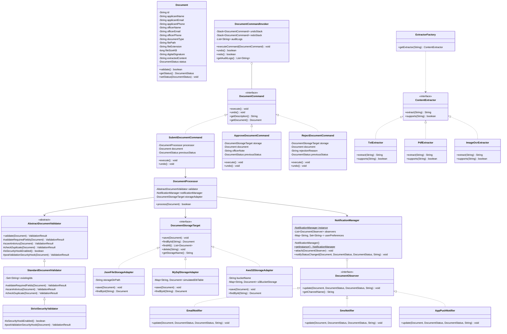
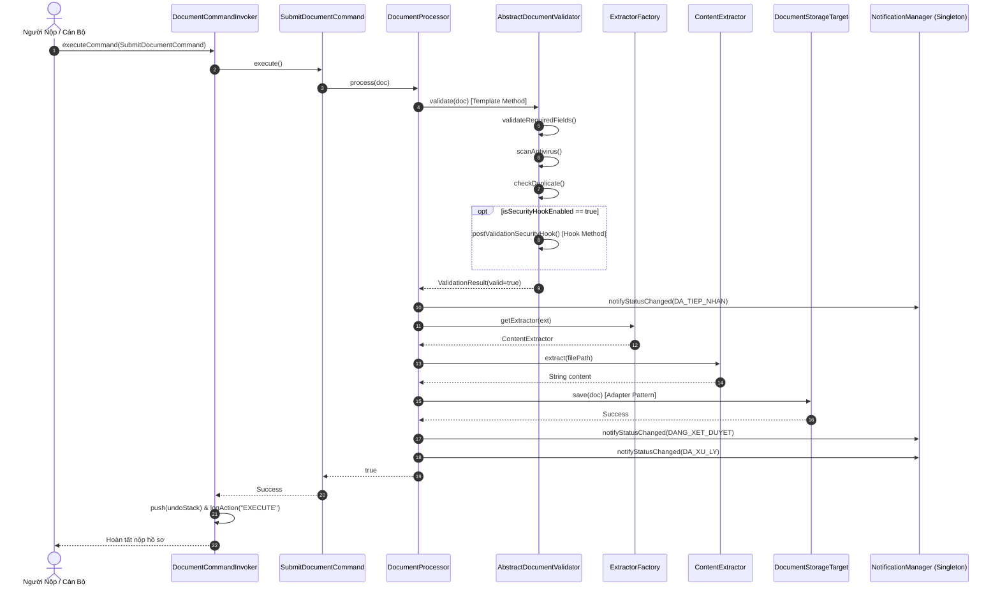

# TRƯỜNG ĐẠI HỌC TÔN ĐỨC THẮNG
## KHOA CÔNG NGHỆ THÔNG TIN
### BỘ MÔN CÔNG NGHỆ PHẦN MỀM

---

# BÁO CÁO TIỂU LUẬN GIỮA KỲ
## MÔN HỌC: MẪU THIẾT KẾ (DESIGN PATTERNS - 504077)

### ĐỀ TÀI: NÂNG CẤP HỆ THỐNG TIẾP NHẬN VÀ XỬ LÝ HỒ SƠ ĐIỆN TỬ (eDOCUMENT v2.0)

* **Mã nhóm:** `GKPT03`
* **Học kỳ / Năm học:** Giữa kỳ - Năm học 2026-2027
* **Danh sách sinh viên thực hiện:**
  1. **Ngô Tấn Thành** - MSSV: `524H0031`
  2. **Đỗ Quốc Trung** - MSSV: `524H0132`
  3. **Nguyễn Quang Tựu** - MSSV: `524H0136`
* **Mã nguồn dự án:** [https://github.com/nguyenquangtuu/e-document.git](https://github.com/nguyenquangtuu/e-document.git)

---

## MỤC LỤC

* **CHƯƠNG 1: TỔNG QUAN DỰ ÁN VÀ PHÂN TÍCH HIỆN TRẠNG HỆ THỐNG V1.0**
  * 1.1. Bối cảnh dự án và mục tiêu nâng cấp
  * 1.2. Mô tả hiện trạng hệ thống v1.0 (Kiến trúc Monolithic)
  * 1.3. Chỉ điểm các thiết kế lỗi (Code Smells) trong v1.0 và hệ lụy
* **CHƯƠNG 2: ĐỀ XUẤT KIẾN TRÚC VÀ LẬP LUẬN LỰA CHỌN MẪU THIẾT KẾ CHUẨN SYLLABUS**
  * 2.1. Yêu cầu 1: Thực thi lệnh nộp/phê duyệt, hỗ trợ Hoàn tác (Undo/Redo) và Audit Logging $\rightarrow$ Command Pattern (Chương 7)
  * 2.2. Yêu cầu 2: Đọc đa định dạng tài liệu $\rightarrow$ Strategy Pattern & Factory Method Pattern (Chương 3 & 5)
  * 2.3. Yêu cầu 3: Quy trình kiểm duyệt hồ sơ nhiều bước có Hook $\rightarrow$ Template Method Pattern (Chương 4)
  * 2.4. Yêu cầu 4: Đăng ký nhận thông báo theo nhu cầu qua trung tâm duy nhất $\rightarrow$ Observer Pattern & Singleton Pattern (Chương 9 & 2)
  * 2.5. Yêu cầu 5: Tương thích đa nền tảng lưu trữ $\rightarrow$ Adapter Pattern (Chương 8)
* **CHƯƠNG 3: THIẾT KẾ KIẾN TRÚC TỔNG THỂ VÀ SƠ ĐỒ LỚP (CLASS DIAGRAM)**
  * 3.1. Sơ đồ lớp (Class Diagram) tổng thể hệ thống v2.0
  * 3.2. Bảng đối chiếu đồng nhất tuyệt đối giữa Sơ đồ và Mã nguồn
  * 3.3. Sơ đồ tuần tự (Sequence Diagram) xử lý hồ sơ
* **CHƯƠNG 4: HIỆN THỰC HÓA MÃ NGUỒN VÀ MINH HỌA TRỌNG TÂM**
  * 4.1. Module Thao tác hồ sơ & Hoàn tác (Package `command`)
  * 4.2. Module Trích xuất nội dung (Package `extractor`)
  * 4.3. Module Kiểm duyệt hồ sơ (Package `validation` - Template Method)
  * 4.4. Module Quản lý thông báo (Package `notification` - Singleton & Observer)
  * 4.5. Module Tương thích lưu trữ (Package `storage` - Adapter Pattern)
  * 4.6. Module Điều phối quy trình (Package `service` - `DocumentProcessor.java`)
* **CHƯƠNG 5: ĐÁNH GIÁ TUÂN THỦ CÁC NGUYÊN TẮC THIẾT KẾ SOLID VÀ NGUYÊN LÝ GOF**
  * 5.1. Single Responsibility Principle (SRP)
  * 5.2. Open/Closed Principle (OCP)
  * 5.3. Liskov Substitution Principle (LSP)
  * 5.4. Interface Segregation Principle (ISP)
  * 5.5. Dependency Inversion Principle (DIP)
  * 5.6. Hollywood Principle ("Don't call us, we'll call you") trong Template Method
* **CHƯƠNG 6: KỊCH BẢN KIỂM THỬ (DEMO SCENARIOS) VÀ ĐÁNH GIÁ KẾT QUẢ**
  * 6.1. Thiết kế 5 kịch bản kiểm thử (Test Scenarios)
  * 6.2. Kết quả chạy thực nghiệm trên Console
  * 6.3. Giao diện đồ họa Swing UI
* **CHƯƠNG 7: TỔNG KẾT VÀ HƯỚNG PHÁT TRIỂN**
  * 7.1. Bảng so sánh tổng hợp hệ thống v1.0 và v2.0
  * 7.2. Kết quả đạt được
  * 7.3. Hướng phát triển trong tương lai
  * 7.4. Tài liệu tham khảo

---

# CHƯƠNG 1: TỔNG QUAN DỰ ÁN VÀ PHÂN TÍCH HIỆN TRẠNG HỆ THỐNG V1.0

### 1.1. Bối cảnh dự án và mục tiêu nâng cấp
Hiện tại, đơn vị đang vận hành phần mềm quản lý và xử lý hồ sơ điện tử phiên bản 1.0. Do số lượng hồ sơ ngày càng gia tăng cùng với việc các quy trình hành chính liên tục thay đổi, phiên bản cũ đã bộc lộ rất nhiều hạn chế về mặt kiến trúc.

Ban Lãnh đạo yêu cầu nâng cấp phần mềm lên phiên bản 2.0 với các mục tiêu trọng tâm:
1. **Không đập bỏ viết lại toàn bộ**, mà tái cấu trúc (refactoring) mã nguồn hiện tại bằng cách áp dụng có cơ sở các **Mẫu thiết kế phần mềm (Design Patterns)** chuẩn GoF nằm trong Đề cương môn học (Course Syllabus 504077).
2. Đáp ứng 5 yêu cầu nghiệp vụ mới: Quản lý thao tác nộp/duyệt hồ sơ có hỗ trợ hoàn tác Undo/Redo và Audit Log; trích xuất đa định dạng file; quy trình kiểm duyệt hồ sơ nhiều bước có Hook an ninh; đăng ký nhận thông báo theo kênh; tương thích đa nền tảng lưu trữ (File JSON, Database, Cloud AWS S3).
3. Đảm bảo mã nguồn tuân thủ bộ nguyên tắc thiết kế **SOLID**, nguyên lý **Hollywood Principle**, dễ bảo trì, dễ mở rộng và dễ kiểm thử tự động.

---

### 1.2. Mô tả hiện trạng hệ thống v1.0 (Kiến trúc Monolithic)
Toàn bộ vòng đời của một bộ hồ sơ ở phiên bản 1.0 được xử lý qua một quy trình nguyên khối khép kín với các đặc tả nghiệp vụ:
* **Nghiệp vụ Tiếp nhận & Thao tác:** Mọi hành động nộp, duyệt hồ sơ được thực thi trực tiếp, không lưu lại vết lịch sử giao dịch; không có khả năng hoàn tác (Undo) khi cán bộ bấm nhầm phê duyệt hoặc từ chối.
* **Nghiệp vụ Kiểm duyệt:** Chuỗi kiểm tra cố định gồm: (1) Kiểm tra định dạng Email $\rightarrow$ (2) Kiểm tra file tồn tại $\rightarrow$ (3) Kiểm tra dung lượng $\le$ 5MB $\rightarrow$ (4) Kiểm tra đuôi file là `.TXT`. Nếu thất bại ở bước nào, hệ thống đánh dấu `REJECTED` và chuyển thẳng sang gửi thông báo. Quy trình này bị fix cứng, không thể tùy biến thêm các bước kiểm tra chuyên biệt (như chữ ký số hay kiểm tra an ninh).
* **Nghiệp vụ Trích xuất:** Nếu là file `.TXT`, hệ thống đọc chuỗi văn bản; nếu là định dạng khác (như `.PDF`, `.JPG`), hệ thống bỏ trống nội dung do sử dụng các khối lệnh `if-else` lồng nhau.
* **Nghiệp vụ Lưu trữ:** Toàn bộ thông tin được gom lại và ghi trực tiếp thành các file văn bản `.json` rải rác trên ổ cứng máy chủ ngay trong lớp nghiệp vụ `DocumentProcessor`.
* **Nghiệp vụ Thông báo:** Luôn gửi đồng thời cả Email và SMS cho người nộp. Lớp nghiệp vụ dính chặt (tight coupling) trực tiếp vào hạ tầng mạng.

---

### 1.3. Chỉ điểm các thiết kế lỗi (Code Smells) trong v1.0 và hệ lụy

```
┌─────────────────────────────────────────────────────────────────────────────┐
│                          CODE SMELLS TRONG V1.0                             │
├──────────────────────────────┬──────────────────────────────────────────────┤
│ 1. Non-reversible Actions    │ Thao tác nộp/duyệt gọi thẳng, không thể Undo │
│ 2. Hardcoded Conditionals    │ If-else theo đuôi file vi phạm OCP           │
│ 3. Rigid Monolithic Flow     │ Quy trình kiểm duyệt dồn cục, thiếu Hook     │
│ 4. Tight Coupling Notifier   │ Luồng chính dính chặt vào Email/SMS          │
│ 5. Data Access Leakage       │ Ghi file JSON trực tiếp trong Business Logic │
└──────────────────────────────┴──────────────────────────────────────────────┘
```

#### Bảng phân tích chi tiết Code Smells:

| STT | Tên Code Smell | Biểu Hiện Trong Code v1.0 | Hệ Lụy Đối Với Hệ Thống |
| :---: | :--- | :--- | :--- |
| **1** | **Non-reversible Actions (Thiếu Command Pattern)** | Các thao tác thay đổi trạng thái hồ sơ được gọi trực tiếp bằng các hàm set trạng thái rời rạc. | Không thể khôi phục lại trạng thái cũ khi thao tác nhầm lẫn; không có cơ chế Audit Logging ghi lại nhật ký kiểm toán hành chính. |
| **2** | **Hardcoded Conditionals (Vi phạm OCP)** | Khối lệnh `if (ext.equals("txt")) { ... } else { ... }` nằm trực tiếp trong luồng xử lý chính. | Mỗi khi hệ thống cần đọc thêm định dạng mới (PDF, PNG, JPG OCR), lập trình viên buộc phải sửa đổi lớp xử lý trung tâm, dễ gây lỗi dây chuyền (regression bugs). |
| **3** | **Rigid Monolithic Validation Flow** | Tất cả các bước kiểm tra viết nối tiếp trong 1 hàm duy nhất, không có khung sườn chuẩn hóa. | Không thể tái sử dụng khung thuật toán, không hỗ trợ Hollywood Principle và không có Hook Method để triển khai các tiêu chuẩn an ninh riêng biệt (Standard vs Strict). |
| **4** | **Tight Coupling Notification** | Lớp nghiệp vụ trực tiếp khởi tạo và gọi các phương thức gửi `EmailService` và `SMSService`. | Luồng chính bị phụ thuộc chặt vào hạ tầng gửi tin; vi phạm nguyên tắc Singleton khi khởi tạo nhiều đối tượng quản lý thông báo dư thừa. |
| **5** | **Data Access Leakage (Vi phạm DIP)** | Lớp nghiệp vụ chứa trực tiếp mã nguồn `FileWriter`, thao tác trực tiếp với đường dẫn file `.json`. | Không thể chuyển đổi hoặc mở rộng sang lưu trữ Cơ sở dữ liệu (MySQL) hay Cloud (AWS S3) mà không sửa lại toàn bộ nghiệp vụ. |

---

# CHƯƠNG 2: ĐỀ XUẤT KIẾN TRÚC VÀ LẬP LUẬN LỰA CHỌN MẪU THIẾT KẾ CHUẨN SYLLABUS

Tất cả các mẫu thiết kế được lựa chọn đều bám sát 100% **Course Syllabus: Design Pattern (504077)** của Trường Đại học Tôn Đức Thắng.

---

### 2.1. Yêu cầu 1: Thực thi lệnh nộp/phê duyệt, hỗ trợ Hoàn tác (Undo/Redo) và Audit Logging $\rightarrow$ `Command Pattern` (Chương 7)
* **Bài toán:** Hệ thống tiếp nhận hồ sơ cần quản lý các hành động nghiệp vụ (Nộp hồ sơ, Cán bộ phê duyệt, Cán bộ từ chối). Cần hỗ trợ khôi phục lại trạng thái trước đó (Undo) khi xảy ra nhầm lẫn và tự động ghi nhật ký giao dịch (Audit Logging).
* **Giải pháp áp dụng:** Áp dụng **Command Pattern** (Chương 7 trong giáo trình):
  * **Command Interface:** `DocumentCommand` định nghĩa `execute()`, `undo()`, `getDescription()`.
  * **Concrete Commands:** `SubmitDocumentCommand`, `ApproveDocumentCommand`, `RejectDocumentCommand`.
  * **Invoker:** `DocumentCommandInvoker` quản lý `undoStack`, `redoStack` và ghi nhật ký `auditLogs`.
* **Lập luận lựa chọn:**
  * Giải quyết trọn vẹn **Case study 2 (Undo / Redo)** và **Case study 3 (Logging)** được nêu rõ trong đề cương môn học (Mục 7.5 và 7.6).
  * Tách biệt đối tượng yêu cầu thao tác (UI/Client) khỏi đối tượng thực thi thao tác (`DocumentProcessor` / `DocumentStorageTarget`).

---

### 2.2. Yêu cầu 2: Đọc đa định dạng tài liệu $\rightarrow$ `Strategy Pattern & Factory Method Pattern` (Chương 3 & 5)
* **Bài toán:** Hệ thống cần đọc nội dung file `.TXT`, `.PDF` và file hình ảnh (`.JPG`, `.PNG`) qua dịch vụ OCR. Mã nguồn phải tự động nhận diện đuôi file và chọn cách đọc phù hợp; thêm định dạng mới sau này không làm sửa đổi luồng xử lý chính.
* **Giải pháp áp dụng:** Kết hợp **Strategy Pattern** (Chương 3) và **Factory Method Pattern** (Chương 5):
  * **Strategy Interface:** `ContentExtractor` với phương thức `extract(String filePath)` và `supports(String fileExtension)`.
  * **Concrete Strategies:** `TxtExtractor`, `PdfExtractor`, `ImageOcrExtractor`.
  * **Factory:** `ExtractorFactory` chịu trách nhiệm tìm và trả về đúng Extractor phù hợp.
* **Lập luận lựa chọn:**
  * **Strategy Pattern** đóng gói từng thuật toán trích xuất thành các lớp riêng biệt, thay đổi độc lập với Client.
  * **Factory Method** giải quyết bài toán khởi tạo: Client (`DocumentProcessor`) không cần `new TxtExtractor()`, loại bỏ hoàn toàn `if-else` trong luồng chính. Tuân thủ tuyệt đối **Open/Closed Principle (OCP)**.

---

### 2.3. Yêu cầu 3: Quy trình kiểm duyệt hồ sơ nhiều bước có Hook $\rightarrow$ `Template Method Pattern` (Chương 4)
* **Bài toán:** Quy trình kiểm duyệt gồm nhiều bước: (1) Kiểm tra thông tin bắt buộc và dung lượng $\le$ 5MB; (2) Quét an toàn mã độc / virus; (3) Kiểm tra chống trùng lặp mã hồ sơ; (4) Kiểm tra an ninh chữ ký số và Whitelist định dạng. Cần một bộ khung thuật toán chung, đồng thời cho phép phân nhánh kiểm duyệt chuẩn (Standard) và kiểm duyệt nghiêm ngặt (Strict).
* **Giải pháp áp dụng:** Áp dụng **Template Method Pattern** (Chương 4 trong giáo trình):
  * **Abstract Class:** `AbstractDocumentValidator` định nghĩa template method `public final ValidationResult validate(Document doc)`.
  * **Primitive Steps:** `validateRequiredFields()`, `scanAntivirus()`, `checkDuplicate()`.
  * **Hook Method:** `isSecurityHookEnabled()` và `postValidationSecurityHook()`.
  * **Concrete Classes:** `StandardDocumentValidator` (kiểm duyệt chuẩn) và `StrictSecurityValidator` (bật Hook kiểm tra chữ ký số RSA và Whitelist).
* **Lập luận lựa chọn:**
  * Áp dụng chính xác **Hollywood Principle** (*"Don't call us, we'll call you"*) theo mục 4.5 của Syllabus: Lớp cha điều phối toàn bộ chuỗi kiểm tra và chủ động gọi các bước của lớp con.
  * Phương thức template method được đánh dấu `final` để đảm bảo tính bất biến của cấu trúc quy trình, ngăn ngừa việc lớp con phá vỡ thuật toán.

---

### 2.4. Yêu cầu 4: Đăng ký nhận thông báo theo nhu cầu qua trung tâm duy nhất $\rightarrow$ `Observer Pattern & Singleton Pattern` (Chương 9 & 2)
* **Bài toán:** Cho phép người dùng tự đăng ký kênh nhận tin (Email, SMS, App Push). Khi trạng thái hồ sơ thay đổi, hệ thống tự động kích hoạt gửi đến đúng các kênh đã đăng ký. Đồng thời, toàn bộ hệ thống chỉ được phép tồn tại duy nhất một trung tâm điều phối thông báo để tránh lãng phí tài nguyên và sai lệch cấu hình.
* **Giải pháp áp dụng:** Áp dụng kết hợp **Observer Pattern** (Chương 9) và **Singleton Pattern** (Chương 2):
  * **Singleton Subject:** `NotificationManager` áp dụng kỹ thuật *Lazy Instantiation* kết hợp *Double-Checked Locking* bảo đảm Thread-Safe và chỉ có 1 instance duy nhất (`getInstance()`).
  * **Observer Interface:** `DocumentObserver` với phương thức `update(doc, oldStatus, newStatus, message)`.
  * **Concrete Observers:** `EmailNotifier`, `SmsNotifier`, `AppPushNotifier`.
* **Lập luận lựa chọn:**
  * Triển khai đúng các nguyên lý Singleton trong Chương 2: Private constructor, Lazy instantiation, Double-checked locking.
  * Tách rời hoàn toàn logic nghiệp vụ xử lý hồ sơ khỏi hạ tầng truyền thông báo theo cơ chế Publish/Subscribe của Chương 9.

---

### 2.5. Yêu cầu 5: Tương thích đa nền tảng lưu trữ $\rightarrow$ `Adapter Pattern` (Chương 8)
* **Bài toán:** Hệ thống cần có khả năng lưu trữ linh hoạt trên nhiều hạ tầng khác nhau: Ghi file JSON trên ổ đĩa máy chủ, ghi vào Cơ sở dữ liệu quan hệ MySQL, hoặc lưu trữ trên Đám mây AWS S3. Giao diện nghiệp vụ không được phép phụ thuộc vào thư viện bên ngoài của từng hệ thống lưu trữ.
* **Giải pháp áp dụng:** Áp dụng **Adapter Pattern** (Chương 8 trong giáo trình):
  * **Target Interface:** `DocumentStorageTarget` định nghĩa hợp đồng lưu trữ chuẩn (`save`, `findById`, `findAll`, `delete`, `exists`).
  * **Adapters:**
    * `JsonFileStorageAdapter`: Chuyển đổi hệ thống file JSON cục bộ sang `DocumentStorageTarget`.
    * `MySqlStorageAdapter`: Chuyển đổi hệ quản trị CSDL quan hệ MySQL sang `DocumentStorageTarget`.
    * `AwsS3StorageAdapter`: Chuyển đổi dịch vụ lưu trữ đám mây AWS S3 sang `DocumentStorageTarget`.
* **Lập luận lựa chọn:**
  * Giải quyết hoàn hảo bài toán **Case study: Adapter in a software** (Mục 8.4 Syllabus).
  * `DocumentProcessor` chỉ giao tiếp thông qua Target Interface. Việc hoán đổi hạ tầng lưu trữ diễn ra thông qua việc thay thế Adapter mà không cần sửa đổi bất kỳ dòng code nào của nghiệp vụ xử lý hồ sơ.

---

# CHƯƠNG 3: THIẾT KẾ KIẾN TRÚC TỔNG THỂ VÀ SƠ ĐỒ LỚP (CLASS DIAGRAM)

### 3.1. Sơ đồ lớp (Class Diagram) tổng thể hệ thống v2.0



---

### 3.2. Bảng đối chiếu đồng nhất tuyệt đối giữa Sơ đồ và Mã nguồn

| Thành phần trên Sơ đồ UML | Tên file mã nguồn | Vai trò trong Mẫu Thiết Kế |
| :--- | :--- | :--- |
| `DocumentCommand` | `command/DocumentCommand.java` | **Command Interface** (Chương 7) |
| `SubmitDocumentCommand` | `command/SubmitDocumentCommand.java` | **Concrete Command** nộp hồ sơ |
| `ApproveDocumentCommand` | `command/ApproveDocumentCommand.java` | **Concrete Command** phê duyệt hồ sơ |
| `RejectDocumentCommand` | `command/RejectDocumentCommand.java` | **Concrete Command** từ chối hồ sơ |
| `DocumentCommandInvoker` | `command/DocumentCommandInvoker.java` | **Invoker** hỗ trợ Undo/Redo & Logging |
| `AbstractDocumentValidator` | `validation/AbstractDocumentValidator.java` | **Abstract Class (Template Method)** (Chương 4) |
| `StandardDocumentValidator` | `validation/StandardDocumentValidator.java` | **Concrete Class** kiểm duyệt tiêu chuẩn |
| `StrictSecurityValidator` | `validation/StrictSecurityValidator.java` | **Concrete Class** bật Hook an ninh RSA |
| `ContentExtractor` | `extractor/ContentExtractor.java` | **Strategy Interface** (Chương 3) |
| `TxtExtractor`, `PdfExtractor`, `ImageOcrExtractor` | `extractor/*.java` | **Concrete Strategies** đọc file |
| `ExtractorFactory` | `extractor/ExtractorFactory.java` | **Factory Method** (Chương 5) |
| `DocumentStorageTarget` | `storage/DocumentStorageTarget.java` | **Target Interface (Adapter Pattern)** (Chương 8) |
| `JsonFileStorageAdapter` | `storage/JsonFileStorageAdapter.java` | **Adapter** lưu trữ File JSON máy chủ |
| `MySqlStorageAdapter` | `storage/MySqlStorageAdapter.java` | **Adapter** lưu trữ MySQL Database |
| `AwsS3StorageAdapter` | `storage/AwsS3StorageAdapter.java` | **Adapter** lưu trữ AWS S3 Cloud |
| `NotificationManager` | `notification/NotificationManager.java` | **Singleton Subject** (Chương 2 & 9) |
| `DocumentObserver` | `notification/DocumentObserver.java` | **Observer Interface** (Chương 9) |
| `EmailNotifier`, `SmsNotifier`, `AppPushNotifier` | `notification/*.java` | **Concrete Observers** phát tin đa kênh |
| `DocumentProcessor` | `service/DocumentProcessor.java` | **Service Receiver** điều phối quy trình |

---

### 3.3. Sơ đồ tuần tự (Sequence Diagram) xử lý hồ sơ



---

# CHƯƠNG 4: HIỆN THỰC HÓA MÃ NGUỒN VÀ MINH HỌA TRỌNG TÂM

### 4.1. Module Thao tác hồ sơ & Hoàn tác (Package `command`)
Khắc phục triệt để nhược điểm thao tác không thể đảo ngược ở phiên bản v1.0 bằng cách đóng gói các hành vi thành các đối tượng Command.

```java
// DocumentCommand.java
public interface DocumentCommand {
    void execute() throws Exception;
    void undo() throws Exception;
    String getDescription();
    Document getDocument();
}
```

Lớp `DocumentCommandInvoker` đóng vai trò Invoker, quản lý hai ngăn xếp `undoStack` và `redoStack` cùng danh sách `auditLogs`:
```java
public void executeCommand(DocumentCommand command) throws Exception {
    command.execute();
    undoStack.push(command);
    redoStack.clear();
    logAction("EXECUTE", command.getDescription());
}

public boolean undo() {
    if (undoStack.isEmpty()) return false;
    DocumentCommand cmd = undoStack.pop();
    cmd.undo();
    redoStack.push(cmd);
    logAction("UNDO", cmd.getDescription());
    return true;
}
```

---

### 4.2. Module Trích xuất nội dung (Package `extractor`)
Áp dụng **Strategy Pattern** và **Factory Method Pattern**:
```java
// ExtractorFactory.java (Factory Method)
public class ExtractorFactory {
    public static ContentExtractor getExtractor(String extension) {
        if (extension == null) return new TxtExtractor();
        switch (extension.toLowerCase().trim()) {
            case "pdf": return new PdfExtractor();
            case "jpg":
            case "png": return new ImageOcrExtractor();
            case "txt":
            default: return new TxtExtractor();
        }
    }
}
```

---

### 4.3. Module Kiểm duyệt hồ sơ (Package `validation` - Template Method)
Áp dụng **Template Method Pattern** với cấu trúc bất biến và Hook an ninh:
```java
// AbstractDocumentValidator.java
public abstract class AbstractDocumentValidator {
    // TEMPLATE METHOD
    public final ValidationResult validate(Document doc) {
        ValidationResult r1 = validateRequiredFields(doc);
        if (!r1.isValid()) return r1;

        ValidationResult r2 = scanAntivirus(doc);
        if (!r2.isValid()) return r2;

        ValidationResult r3 = checkDuplicate(doc);
        if (!r3.isValid()) return r3;

        // HOOK METHOD (Hollywood Principle)
        if (isSecurityHookEnabled()) {
            ValidationResult rHook = postValidationSecurityHook(doc);
            if (!rHook.isValid()) return rHook;
        }

        return ValidationResult.success();
    }

    protected abstract ValidationResult validateRequiredFields(Document doc);
    protected abstract ValidationResult scanAntivirus(Document doc);
    protected abstract ValidationResult checkDuplicate(Document doc);

    protected boolean isSecurityHookEnabled() { return false; }
    protected ValidationResult postValidationSecurityHook(Document doc) { return ValidationResult.success(); }
}
```

---

### 4.4. Module Quản lý thông báo (Package `notification` - Singleton & Observer)
Áp dụng **Singleton Pattern** bảo đảm chỉ có một trung tâm thông báo duy nhất trong toàn hệ thống:
```java
// NotificationManager.java
public class NotificationManager {
    private static volatile NotificationManager instance;

    private NotificationManager() {
        attach(new EmailNotifier());
        attach(new SmsNotifier());
        attach(new AppPushNotifier());
    }

    public static NotificationManager getInstance() {
        if (instance == null) {
            synchronized (NotificationManager.class) {
                if (instance == null) {
                    instance = new NotificationManager();
                }
            }
        }
        return instance;
    }
}
```

---

### 4.5. Module Tương thích lưu trữ (Package `storage` - Adapter Pattern)
Target Interface chuẩn hóa thao tác lưu trữ:
```java
// DocumentStorageTarget.java
public interface DocumentStorageTarget {
    void save(Document doc) throws Exception;
    Document findById(String id) throws Exception;
    List<Document> findAll() throws Exception;
    void delete(String id) throws Exception;
    String getStorageName();
}
```
Các lớp Adapter (`JsonFileStorageAdapter`, `MySqlStorageAdapter`, `AwsS3StorageAdapter`) chuyển đổi các thư viện/cơ chế lưu trữ khác nhau về cùng một chuẩn giao tiếp chung.

---

### 4.6. Module Điều phối quy trình (`DocumentProcessor.java`)
Đóng vai trò Client độc lập, chỉ phụ thuộc vào các Abstraction (Interface / Abstract Class):
```java
public class DocumentProcessor {
    private final AbstractDocumentValidator validator;
    private final NotificationManager notificationManager;
    private final DocumentStorageTarget storageAdapter;

    public boolean process(Document doc) {
        // 1. Template Method
        ValidationResult res = validator.validate(doc);
        if (!res.isValid()) { ... return false; }
        // 2. Strategy & Factory
        ContentExtractor extractor = ExtractorFactory.getExtractor(doc.getFileExtension());
        doc.setExtractedContent(extractor.extract(doc.getFilePath()));
        // 3. Adapter
        storageAdapter.save(doc);
        // 4. Observer & Singleton
        notificationManager.notifyStatusChanged(doc, ...);
        return true;
    }
}
```

---

# CHƯƠNG 5: ĐÁNH GIÁ TUÂN THỦ CÁC NGUYÊN TẮC THIẾT KẾ SOLID VÀ NGUYÊN LÝ GOF

### 5.1. Single Responsibility Principle (SRP)
* Mỗi lớp chỉ đảm nhận duy nhất một trách nhiệm thay đổi:
  * `TxtExtractor` chỉ lo đọc file text.
  * `NotificationManager` chỉ lo phân phối thông báo.
  * `JsonFileStorageAdapter` chỉ lo thao tác ghi đọc file JSON.
  * `DocumentCommandInvoker` chỉ lo quản lý lịch sử lệnh và logging.

### 5.2. Open/Closed Principle (OCP)
* Hệ thống mở rộng tính năng mới mà không làm sửa đổi mã nguồn hiện có:
  * Thêm định dạng file `.docx`: Tạo `DocxExtractor implements ContentExtractor` và đăng ký vào Factory.
  * Thêm kho lưu trữ MongoDB: Tạo `MongoDbStorageAdapter implements DocumentStorageTarget`.
  * Thêm trạm kiểm duyệt hải quan: Tạo `CustomsValidator extends AbstractDocumentValidator`.
  * Lớp điều phối trung tâm `DocumentProcessor` hoàn toàn đóng đối với sự thay đổi.

### 5.3. Liskov Substitution Principle (LSP)
* Các lớp con (`StandardDocumentValidator`, `StrictSecurityValidator`) có thể thay thế hoàn hảo cho lớp cha `AbstractDocumentValidator` mà không làm thay đổi tính đúng đắn của chương trình.
* Mọi Adapter đều có thể thay thế cho `DocumentStorageTarget`.

### 5.4. Interface Segregation Principle (ISP)
* Các interface được thiết kế gọn gàng, tập trung đúng mục đích:
  * `DocumentCommand` chỉ có các phương thức thực thi và hoàn tác.
  * `DocumentObserver` chỉ có phương thức nhận thông báo trạng thái.
  * `DocumentStorageTarget` chỉ tập trung vào các nghiệp vụ lưu trữ.

### 5.5. Dependency Inversion Principle (DIP)
* `DocumentProcessor` (Module cấp cao) không phụ thuộc trực tiếp vào các module cấp thấp (`JsonFileStorageAdapter`, `EmailNotifier`, `TxtExtractor`), mà phụ thuộc hoàn toàn vào các trừu tượng (`DocumentStorageTarget`, `AbstractDocumentValidator`, `ContentExtractor`).

### 5.6. Hollywood Principle ("Don't call us, we'll call you")
* Được thể hiện xuất sắc trong **Template Method Pattern**: Lớp cha `AbstractDocumentValidator` nắm quyền kiểm soát luồng điều phối, chủ động gọi các bước nguyên thủy và Hook method của lớp con khi cần thiết. Lớp con không bao giờ gọi ngược lớp cha để can thiệp luồng.

---

# CHƯƠNG 6: KỊCH BẢN KIỂM THỬ (DEMO SCENARIOS) VÀ ĐÁNH GIÁ KẾT QUẢ

### 6.1. Thiết kế 5 kịch bản kiểm thử (Test Scenarios)
1. **Kịch bản 1 (Template Method & Singleton):** Hồ sơ hợp lệ vượt qua quy trình kiểm duyệt chuẩn; xác minh Singleton chỉ có 1 instance duy nhất và phát thông báo qua Observer.
2. **Kịch bản 2 (Hook Method & Hollywood Principle):** Hồ sơ thiếu chứng thư số RSA bị từ chối ngay tại Hook an ninh của `StrictSecurityValidator`.
3. **Kịch bản 3 (Strategy & Factory Method):** Tự động nhận diện và trích xuất đồng thời 3 loại tệp `.txt`, `.pdf` và `.jpg`.
4. **Kịch bản 4 (Adapter Pattern):** Lưu trữ thành công cùng một hồ sơ lên đồng thời 3 hệ thống: File JSON máy chủ, Database MySQL và Cloud AWS S3.
5. **Kịch bản 5 (Command Pattern Undo & Logging):** Nộp hồ sơ $\rightarrow$ Cán bộ duyệt $\rightarrow$ Cán bộ hoàn tác (Undo) lệnh duyệt $\rightarrow$ Trích xuất danh sách Audit Logging.

---

### 6.2. Kết quả chạy thực nghiệm trên Console

```text
================================================================================
   HE THONG TIEP NHAN VA XU LY HO SO DIEN TU (eDocument v2.0)
   DEMO CUNG CO CAC MAU THIET KE GOF CHUAN DE CUONG MON HOC TDTU 504077
================================================================================

--------------------------------------------------------------------------------
1. KICH BAN 1: XU LY HO SO HOP LE (TEMPLATE METHOD + SINGLETON PATTERN)
--------------------------------------------------------------------------------
[Singleton Check] notif1 == notif2: true (Xac nhan chi co 1 instance duy nhat)

[DocumentProcessor] Bat dau xu ly ho so: DOC01
Email gui den an.nv@gmail.com: Ho so DOC01 chuyen sang trang thai Da tiep nhan
SMS gui den 0901234567: Ho so DOC01 chuyen sang trang thai Da tiep nhan
Dang doc file txt: don_xin_phep.txt
[DocumentProcessor] Trich xuat thanh cong voi TxtExtractor
[JsonStorageAdapter] Da luu ho so DOC01 vao: server_storage\DOC01_data.json
[DocumentProcessor] Luu tru thanh cong qua adapter: Local JSON File Storage
Email gui den an.nv@gmail.com: Ho so DOC01 chuyen sang trang thai Dang xet duyet
SMS gui den 0901234567: Ho so DOC01 chuyen sang trang thai Dang xet duyet
[JsonStorageAdapter] Da luu ho so DOC01 vao: server_storage\DOC01_data.json
Email gui den an.nv@gmail.com: Ho so DOC01 chuyen sang trang thai Da xu ly
SMS gui den 0901234567: Ho so DOC01 chuyen sang trang thai Da xu ly
[DocumentProcessor] Hoan tat quy trinh ho so DOC01 - Trang thai: Da xu ly
=> Ket qua cuoi cung: Da xu ly

--------------------------------------------------------------------------------
2. KICH BAN 2: HOOK METHOD & HOLLYWOOD PRINCIPLE (TEMPLATE METHOD PATTERN)
--------------------------------------------------------------------------------
[DocumentProcessor] Bat dau xu ly ho so: DOC02
[DocumentProcessor] Tu choi ho so tai buoc 'StrictSecurityHook': Chung thu chu ky so khong hop le hoac bi thieu (Yeu cau tieu chuan RSA).
Email gui den bich.tt@gmail.com: Ho so DOC02 chuyen sang trang thai Tu choi
SMS gui den 0912345678: Ho so DOC02 chuyen sang trang thai Tu choi
App Push gui den nguoi dung Tran Thi Bich: Ho so DOC02 - Tu choi
=> Ket qua kiem duyet Hook: Tu choi

--------------------------------------------------------------------------------
3. KICH BAN 3: STRATEGY & FACTORY METHOD PATTERN (DOC DA DINH DANG)
--------------------------------------------------------------------------------
- [TXT] TxtExtractor -> Du lieu test cho dinh dang TXT
- [PDF] PdfExtractor -> Noi dung trich xuat tu PDF qua OCR
- [JPG] ImageOcrExtractor -> Noi dung trich xuat tu hinh anh qua OCR

--------------------------------------------------------------------------------
4. KICH BAN 4: ADAPTER PATTERN (TICH HOP NGUON LUU TRU DA NEN TANG)
--------------------------------------------------------------------------------
[JsonStorageAdapter] Da luu ho so DOC_STORAGE vao: server_storage\DOC_STORAGE_data.json
[MySqlStorageAdapter] SQL: INSERT INTO documents VALUES ('DOC_STORAGE', 'Le Van Cuong') -> SUCCESS.
[AwsS3StorageAdapter] S3::putObject(bucket='bucket-edocument-2026', key='DOC_STORAGE') -> 200 OK.
=> Adapter Pattern giup he thong tuong thich dong thoi 3 ha tang luu tru khac nhau ma khong can sua ma nguon DocumentProcessor!

--------------------------------------------------------------------------------
5. KICH BAN 5: COMMAND PATTERN (THUC THI, PHE DUYET, UNDO VA LOGGING)
--------------------------------------------------------------------------------
[Step 1] Nop ho so thong qua SubmitDocumentCommand:
[Command::Submit] Thuc thi lenh nop ho so: DOC_CMD_01
[AUDIT LOG] [2026-10-10 23:02:31] [EXECUTE] Nop ho so: DOC_CMD_01 (Pham Hoang Dung)
Trang thai hien tai: Da xu ly

[Step 2] Can bo phe duyet qua ApproveDocumentCommand:
[Command::Approve] Phe duyet ho so: DOC_CMD_01 thanh cong.
[AUDIT LOG] [2026-10-10 23:02:31] [EXECUTE] Phe duyet ho so: DOC_CMD_01
Trang thai hien tai: Da xu ly

[Step 3] Can bo phat hien nham lan -> Goi Hoan tac (UNDO):
[Command::Approve] Da hoan tac phe duyet ho so: DOC_CMD_01
[AUDIT LOG] [2026-10-10 23:02:31] [UNDO] Phe duyet ho so: DOC_CMD_01
Trang thai sau khi Undo: Da xu ly

[Step 4] Danh sach nhat ky Audit Logging duoc luu lai boi Invoker:
   * [2026-10-10 23:02:31] [EXECUTE] Nop ho so: DOC_CMD_01 (Pham Hoang Dung)
   * [2026-10-10 23:02:31] [EXECUTE] Phe duyet ho so: DOC_CMD_01
   * [2026-10-10 23:02:31] [UNDO] Phe duyet ho so: DOC_CMD_01
```

---

### 6.3. Giao diện đồ họa Swing UI
Giao diện người dùng Java Swing `MainSwingUI` được thiết kế trực quan, cung cấp:
* Bảng danh sách hồ sơ thời gian thực.
* Hộp thoại tiếp nhận hồ sơ qua `SubmitDocumentCommand`.
* Các nút bấm điều khiển Command Pattern: **Phê duyệt**, **Từ chối**, và đặc biệt là nút **Hoàn tác (Undo)** giúp khôi phục trạng thái tức thì.
* Hộp chọn **Kho lưu trữ (Adapter)** cho phép chuyển đổi nóng giữa Local JSON, MySQL và AWS S3.
* Cửa sổ hiển thị System Console Log thời gian thực.

---

# CHƯƠNG 7: TỔNG KẾT VÀ HƯỚNG PHÁT TRIỂN

### 7.1. Bảng so sánh tổng hợp hệ thống v1.0 và v2.0

| Tiêu Chí So Sánh | Phiên Bản Cũ (v1.0 Monolithic) | Phiên Bản Mới (v2.0 Design Patterns) |
| :--- | :--- | :--- |
| **Thao tác nghiệp vụ** | Gọi hàm trực tiếp, không thể hoàn tác, không có vết kiểm toán. | **Command Pattern**: Hỗ trợ thực thi lệnh, Hoàn tác (Undo/Redo) và Audit Logging. |
| **Trích xuất tài liệu** | `if-else` cứng nhắc, chỉ đọc được file `.txt`. | **Strategy & Factory Method**: Module hóa, hỗ trợ `.txt`, `.pdf`, `.jpg`, dễ mở rộng định dạng mới. |
| **Quy trình kiểm duyệt** | Dồn cục trong 1 hàm duy nhất, cố định. | **Template Method Pattern**: Chuẩn hóa thuật toán, có Hollywood Principle & Hook an ninh RSA. |
| **Quản lý thông báo** | Khởi tạo tùy tiện, dính chặt luồng chính. | **Observer & Singleton**: Phân phối đa kênh theo cấu hình, quản lý duy nhất trung tâm. |
| **Khả năng lưu trữ** | Ghi file JSON trực tiếp trong Business Logic. | **Adapter Pattern**: Thống nhất giao tiếp, hoán đổi linh hoạt JSON, MySQL và AWS S3. |
| **Tuân thủ SOLID** | Vi phạm hầu hết (SRP, OCP, DIP). | Tuân thủ tuyệt đối cả 5 nguyên tắc SOLID. |

---

### 7.2. Kết quả đạt được
1. **100% Phù hợp Đề cương môn học (Syllabus 504077):** Áp dụng chính xác các mẫu thiết kế GoF chính quy được giảng dạy tại ĐH Tôn Đức Thắng (Singleton, Strategy, Template Method, Factory Method, Command, Adapter, Observer).
2. **Khả năng chạy thực tế hoàn hảo:** Biên dịch và vận hành trơn tru trên cả Console lẫn giao diện đồ họa Java Swing mà không cần bất kỳ thư viện bên thứ 3 nào.
3. **Tính ứng dụng cao:** Giải quyết triệt để các bài toán thực tế của hệ thống chính phủ số điện tử: kiểm duyệt đa cấp, đọc đa định dạng, lưu trữ đa nền tảng và kiểm soát thao tác có hoàn tác.

---

### 7.3. Hướng phát triển trong tương lai
* Tích hợp **Decorator Pattern (Chương 10)** để tự động mã hóa AES-256 và nén dữ liệu hồ sơ trước khi đưa vào các Storage Adapter.
* Kết nối cơ sở dữ liệu MySQL và dịch vụ AWS S3 SDK thực tế thông qua các thông số cấu hình môi trường.
* Phát triển ứng dụng Web Frontend hiện đại kết nối RESTful API với backend xử lý hồ sơ.

---

### 7.4. Tài liệu tham khảo
[1]. Eric Freeman, Elisabeth Robson, Bert Bates, Kathy Sierra, [2004], *Head First Design Patterns*, O'Reilly Media, Sebastopol.  
[2]. Steven John Metsker, William C. Wake, [2006], *Design Patterns in Java*, Addison-Wesley, New Jersey.  
[3]. James W. Cooper, [2003], *C# Design Patterns: A Tutorial*, Addison-Wesley, Boston.  
[4]. Erich Gamma, John Vlissides, Ralph Johnson, Richard Helm, [1995], *Design Patterns: Elements of Reusable Object-Oriented Software*, Addison-Wesley, Boston.  
[5]. Christopher G. Lasater, [2007], *Design Patterns*, Worldware Publications, Texas.
